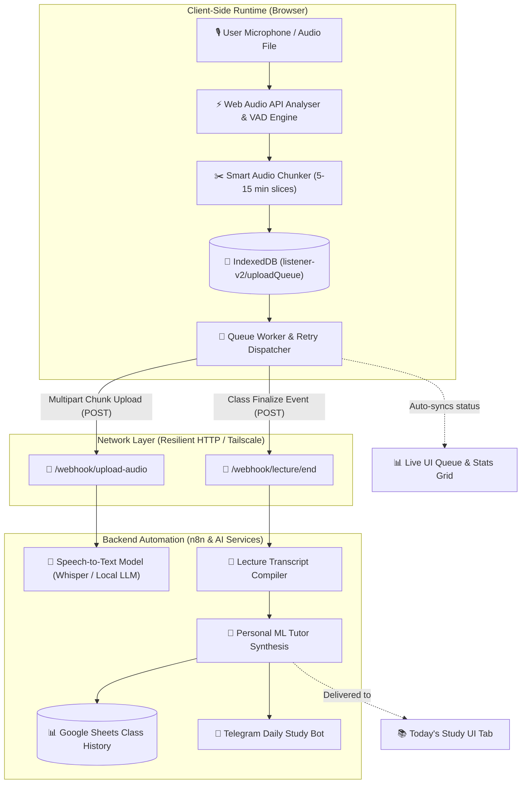

# 🎙️ The Listener — AI Lecture Recorder & ML Tutor

<div align="center">

[](https://github.com/cashiiyy/Listener)
[](https://github.com/cashiiyy/Listener)
[](https://github.com/cashiiyy/Listener)
[](https://github.com/cashiiyy/Listener)
[](https://n8n.io)

<p align="center">
  <b>A zero-dependency, ultra-aesthetic lecture recording client with intelligent chunking, voice activity detection (VAD), offline IndexedDB durability, and seamless n8n automation for AI transcription, summarization, and daily study coaching.</b>
</p>

[✨ Live Preview Guide](#-quick-start) • [📐 Architecture](#-system-architecture) • [🚀 Key Features](#-features) • [🔌 Webhook API](#-webhook-api-specifications) • [⚙️ Configuration](#-configuration--settings)

</div>

---

## 📐 System Architecture

The Listener coordinates browser audio hardware, intelligent speech detection, resilient chunk queuing, and backend AI processing via n8n workflows:



---

## 🚀 Features

<details open>
<summary><b>🎙️ Real-time Audio Capture & Adaptive Codec Selection</b></summary>
<br>

- **Dynamic Format Negotiation**: Automatically chooses the highest quality supported codec available on the client device (`audio/webm;codecs=opus` → `audio/webm` → `audio/ogg;codecs=opus` → `audio/ogg`).
- **Hardware-Accelerated Audio Filtering**: Enables hardware echo cancellation, noise suppression, and automatic gain control (AGC) via `navigator.mediaDevices.getUserMedia`.
- **Live VU Metering**: Real-time microphone audio energy level indicator powered by the Web Audio API Analyser node with normalized RMS gain tracking.
</details>

<details>
<summary><b>✂️ Intelligent Voice Activity Detection (VAD) & Slicing</b></summary>
<br>

- **Silence-Aware Chunking**: Chunks are generated on user-configured durations (default: 10 minutes) but dynamically wait for speech pauses to prevent clipping mid-sentence.
- **Configurable Thresholds**: Energy threshold (`vadThreshold: 0.025`) and silence timeout (`silenceTimeoutMs: 2000`) prevent sending empty silence chunks.
</details>

<details>
<summary><b>💾 Offline Resilience & IndexedDB Durability</b></summary>
<br>

- **Zero Data Loss Guarantee**: Every audio chunk is saved immediately to IndexedDB (`listener-v2` / `uploadQueue`) before any network dispatch is attempted.
- **Exponential Backoff Retries**: Automatic background retry runner with exponential backoff up to 8 attempts.
- **Network Awareness**: Listens to browser `online` and `offline` events; pauses retry traffic when offline and automatically resumes pending transfers when connectivity returns.
</details>

<details>
<summary><b>📁 Universal File Drop Zone</b></summary>
<br>

- **Drag-and-Drop Ingestion**: Upload pre-recorded audio or video lectures (`.mp3`, `.wav`, `.m4a`, `.webm`, `.mp4`, `.mov`, `.ogg`, `.flac`).
- **Parallel Pipeline Ingestion**: Uploaded files feed into the exact same transcription, summarization, and tutor pipeline as live classes.
- **Non-blocking FileReader Uploads**: Uses asynchronous chunk streaming to maintain UI responsiveness even with multi-hundred megabyte recordings.
</details>

<details>
<summary><b>🌌 Antigravity Glassmorphism Design System</b></summary>
<br>

- **Depth & Translucency**: High-clarity frosted panels with `backdrop-filter: blur(28px)`, semi-transparent dark obsidian backdrops, and luminous highlight borders.
- **Ambient GPU Drift**: 3 atmospheric radial glow orbs (`drift1`, `drift2`, `drift3`) providing spatial lighting without CPU strain.
- **Smooth Micro-Interactions**: Hover lifts (`translateY(-2px)`), radiant gradient button lighting, live pulsing status beacon (`.dot.ready`), and accessible reduced-motion support.
</details>

---

## 🗂️ Application Tabs Overview

| Tab | Icon | Purpose | Key Elements |
| :--- | :---: | :--- | :--- |
| **Record Class** | 🎙️ | Primary lecture recording cockpit | Class metadata, live VU meter, chunk progress, recording timer, real-time upload queue list |
| **Upload** | 📁 | Ingest pre-recorded audio/video files | Glassmorphism drag-and-drop zone, format badges, file progress bar, clear/upload actions |
| **Classes** | 📋 | Class history & ingestion logs | Synced record of previous lectures, status badges (Finalized vs In-Progress) |
| **Today's Study**| 📚 | Personalized AI ML Tutor session | Summarized key topics, structured Q&A flashcards, and concept drills |
| **Settings** | ⚙️ | Runtime configuration & endpoints | Chunk duration selector, default metadata, upload & finalize n8n webhook URLs |

---

## 🔌 Webhook API Specifications

The Listener communicates with your backend automation platform (such as n8n, Node.js, or FastAPI) via two clean endpoints:

### 1. Audio Chunk Ingestion Endpoint
* **Default URL**: `https://jarvis.tailc9769c.ts.net:8443/webhook/upload-audio` (Configurable in Settings)
* **Method**: `POST`
* **Content-Type**: `multipart/form-data`

#### Form Fields

| Field Name | Type | Description |
| :--- | :--- | :--- |
| `file` | `Blob / File` | The audio slice binary (`.webm` or `.ogg`) |
| `class_id` | `String` | Unique lecture identifier (e.g. `ML-2026-09-27-X8A2`) |
| `chunk_number` | `Integer` | Sequence number (1-indexed: `1`, `2`, `3`...) |
| `subject` | `String` | Lecture subject name (e.g. `Machine Learning`) |
| `teacher` | `String` | Instructor name |
| `language` | `String` | Target lecture language code (`auto`, `en`, `ml`, `hi`, `ta`) |
| `timestamp` | `String (ISO)` | Client recording timestamp |
| `is_final` | `String ("true"/"false")` | Indicates if this is the final closing chunk |

<details>
<summary><b>View Example cURL Request</b></summary>

```bash
curl -X POST "https://jarvis.tailc9769c.ts.net:8443/webhook/upload-audio" \
  -F "class_id=ML-2026-09-27-9A4B" \
  -F "chunk_number=1" \
  -F "subject=Machine Learning" \
  -F "teacher=Prof. Smith" \
  -F "language=ml" \
  -F "timestamp=2026-09-27T14:30:00.000Z" \
  -F "is_final=false" \
  -F "file=@chunk-1.webm;type=audio/webm"
```
</details>

---

### 2. Lecture Finalization Endpoint
* **Default URL**: `https://jarvis.tailc9769c.ts.net:8443/webhook/lecture/end` (Configurable in Settings)
* **Method**: `POST`
* **Content-Type**: `application/json`

#### JSON Body Payload

```json
{
  "class_id": "ML-2026-09-27-9A4B",
  "subject": "Machine Learning",
  "teacher": "Prof. Smith",
  "language": "ml",
  "total_chunks": 4,
  "ended_at": "2026-09-27T15:10:00.000Z"
}
```

---

## ⚙️ Configuration & Settings

Settings are stored in the client's `localStorage` under the key `listener_cfg` and can be adjusted from the **Settings** tab in the UI:

```javascript
{
  "uploadWebhook": "https://jarvis.tailc9769c.ts.net:8443/webhook/upload-audio",
  "endWebhook": "https://jarvis.tailc9769c.ts.net:8443/webhook/lecture/end",
  "chunkDurationMs": 600000,   // 10 minutes (300000 = 5 min, 900000 = 15 min)
  "vadThreshold": 0.025,       // Voice activity energy detection sensitivity
  "silenceTimeoutMs": 2000,    // Silence pause threshold before chunk boundary
  "retryBaseMs": 3000,         // Initial exponential backoff delay
  "maxRetries": 8,             // Maximum retry attempts before alerting user
  "defaultSubject": "Machine Learning",
  "defaultTeacher": ""
}
```

---

## 🛠️ Browser Compatibility

| Browser | Version | Web Audio API | MediaRecorder | IndexedDB |
| :--- | :---: | :---: | :---: | :---: |
| **Google Chrome** | 80+ | ✅ Supported | ✅ Supported | ✅ Supported |
| **Mozilla Firefox** | 78+ | ✅ Supported | ✅ Supported | ✅ Supported |
| **Apple Safari** | 14.1+ | ✅ Supported | ✅ Supported (AAC/MP4/WebM) | ✅ Supported |
| **Microsoft Edge** | 80+ | ✅ Supported | ✅ Supported | ✅ Supported |
| **Brave / Opera** | Current | ✅ Supported | ✅ Supported | ✅ Supported |

---

## 🗺️ Roadmap & Checklist

- [x] **Antigravity Glassmorphism UI** with depth layers and ambient aurora orbs
- [x] **Zero-dependency Architecture** (Vanilla JS + HTML5 + CSS3)
- [x] **IndexedDB Resilient Chunk Queue** with automatic offline restore
- [x] **Voice Activity Detection (VAD)** and silence boundary detection
- [x] **Direct File Upload Zone** for external audio & video files
- [x] **Customizable n8n Webhook Endpoints** stored in localStorage
- [ ] **ServiceWorker PWA support** for standalone mobile installation
- [ ] **Live Spectrogram Visualization** toggle inside the recorder tab
- [ ] **Direct Telegram Webhook Polling** for in-app instant study feedback

---

## 📄 License

This project is licensed under the [MIT License](LICENSE). Built for students, researchers, and lifelong learners.
